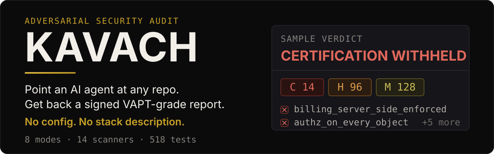
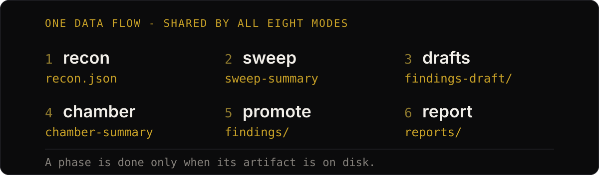
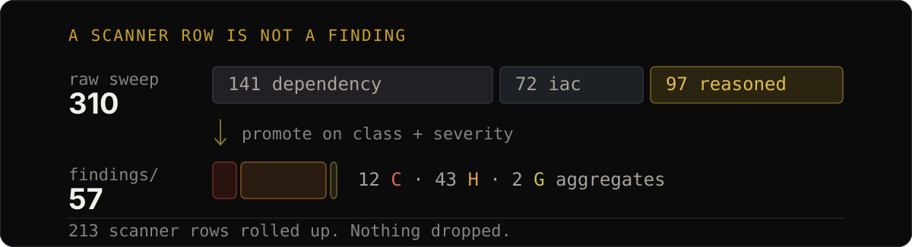

<p align="center">
  
</p>

<p align="center">
  
  
  
  
  
</p>

KAVACH is a **Claude Code skill backed by a deterministic Python core**. It fingerprints your stack,
runs the scanners that stack earns (in Docker), then dispatches specialist subagents to hunt the
attacks that actually end companies - and reconciles everything into kill chains, a CVSS-scored
verdict, and a fail-closed certification.

It hunts six things: **stolen keys** (hardcoded, client-reachable, or in git history) · **free chatbot
abuse** · **billing bypass** (client-trusted prices, unverified webhooks, double-spend) ·
**cross-tenant data theft** (IDOR/BOLA) · **AI hijack** (prompt injection, excessive agency) ·
**malicious dependencies** (real CVEs plus install-script malware and typosquats).

## Quickstart

```bash
git clone https://github.com/adhuniklabs/kavach.git && cd kavach
./install.sh global     # ~/.claude - every repo on this machine
./install.sh project    # ./.claude - this repo; commit to share
```

Then in Claude Code, at any repo root:

```
/kavach              # balanced - the default full audit
/kavach deep         # + patch history, authz/state/spec, cold re-verification, variants
/kavach lite         # fast triage, minutes
/kavach deep --live  # + sandboxed PoC execution against a running instance (opt-in)
```

**Needs** `python3` + `pip` (pulls `PyYAML`, `filelock`). **Docker** unlocks the full scanner suite -
without it a built-in secret scanner and a bundled offline SAST ruleset still run, and subagents
review the rest manually at lower confidence.

## What you get

```
<target>/.kavach/
├── reports/
│   ├── final-audit-report.md   ← primary deliverable
│   ├── audit-report.pdf         ← paged, with contents + figures
│   ├── audit-report.html        ← self-contained
│   └── report.json / .sarif     ← machine contract for CI
├── findings/<C1|H1|G1>-<slug>/  ← report.md, poc.*, evidence/
├── attack-surface/              ← threat model, kill chains, authz
└── audit-state.json             ← resumable run state
```

Every format is built from **one report model**, so they cannot disagree about a number. The PDF
carries a six-axis scorecard, ASVS/CWE/GDPR mapping, per-axis chapters, a three-horizon remediation
plan, and an annex giving the exact command behind every figure.

Unproven controls **fail closed** - an axis nothing looked at reads `not assessed`, never a pass.

## How it works

<p align="center">
  
</p>

The Python core is a **planner, state manager, and renderer - it never talks to a model.**
`skill/SKILL.md` is the only thing that issues `Task` calls. That seam is what keeps KAVACH
model-agnostic and makes every run resumable.

One 26-phase pipeline; a preset is a subset of it, and the three nest -
`lite ⊂ balanced ⊂ deep`.

| Mode | Phases | Use it for |
|---|---|---|
| `lite` | 6 | fast triage - a signal in minutes: recon, secret sweep, one hunter, PoCs, report |
| `balanced` | 13 | **default.** Knowledge base, 8 domain hunters, probe, one chamber pass, intent cross-check, PoCs, per-finding reports |
| `deep` | 20 | adds patch history, authz/state/spec specialists, cross-service taint, cold re-verification, variant search |
| `--live` | +6 | a flag, not a preset: opt-in sandboxed PoC execution appended to any of the three, ending in a confirmation report |

See [`docs/modes.md`](./docs/modes.md) and [`docs/phase-reference.md`](./docs/phase-reference.md).

## Why the report stays readable

<p align="center">
  
</p>

Every finding gets a **class**: `reasoned` (an agent judged it), `code`, `secret`, `dependency`,
`iac`. Promotion keys on class *and* severity - so a CVE row and a cold-verified IDOR stop getting
identical treatment, and 141 CVEs stop becoming 141 hand-written exploit narratives.

Each audit also spends against a **dispatch ledger** (lite 15 · balanced 60 · deep 120, `--live`
adding 30; `--budget N`, `0` for unlimited). Anything a ceiling drops is printed in the report's
*Limits of this run* section, alongside every promoted finding with no PoC and everything still
marked `suspected`. A budget-constrained audit reads as one.

## The core, standalone

```bash
cd core
PYTHONPATH=. python3 -m kavach scan /path/to/repo   # recon + sweep
PYTHONPATH=. python3 -m kavach triage               # classify findings
PYTHONPATH=. python3 -m kavach consolidate          # promote + roll up
PYTHONPATH=. python3 -m kavach coverage --phase poc  # PoC gate
PYTHONPATH=. python3 -m kavach render --format pdf --output audit.pdf
PYTHONPATH=. python3 -m kavach gate                 # CI exit code
PYTHONPATH=. python3 -m kavach corpus               # self-validation
```

### Driving it from your own harness

The engine plans and renders; it never calls a model. Everything a driver needs to dispatch is a
verb, so nothing has to be re-read out of `SKILL.md` prose:

```bash
kavach plan --mode balanced --json --target .    # roster, indices, result paths, gates
kavach phase-prompt hunt --mode balanced --target . --agent kavach-sast --index 1
kavach slice hunt --agent kavach-sast --index 1  # that domain's leads, not all 300 rows
kavach agents --json                             # tools + tier per agent (reasoning|mechanical|triage)
kavach budget charge --phase hunt -n 8 --cost-usd 0.42  # spend, if your harness measures it
kavach events                                    # the run log, one JSON object per line
```

On a large repo, one more before the fan-out:

```bash
kavach scope --agent kavach-billing --limit 200  # rank the manifest by security relevance
```

It's optional and cuts discovery cost - the budget a hunter otherwise spends deciding which file
to open first, not the line it eventually cites.

`tier:` is `model:` spelled provider-neutrally, so a non-Claude harness can route each agent without
knowing Anthropic's model names. See [`docs/orchestration.md`](./docs/orchestration.md).

Or `pip install -e ./core` → `kavach scan .`. **PDF is an optional extra:**
`pip install 'kavach-audit[report]'` adds `reportlab` (pure Python, no system libraries). Without it
`md`/`json`/`sarif` are unaffected, `html` substitutes a table per figure, and `pdf` exits with the
install command rather than a traceback.

Exit codes: `0` clean · `2` open Critical · `3` open High · `4` controls unmet · `5` tooling ·
`6` corpus fail · `7` policy not met (coverage short, or the budget shed work).

## File findings as issues

```bash
kavach issues plan                          # → reports/issues.json
kavach issues push --repo owner/name        # DRY RUN, prints commands
kavach issues push --repo owner/name --yes  # actually files them
```

Two phases on purpose: **without `--yes`, nothing is ever created.** Idempotent on the stable KAVACH
id, so a re-audit comments on the existing issue instead of filing a duplicate. `secret`-class
findings export **redacted** - `file:line` and remediation only, matched value withheld and left in
the local tree. GitHub via `gh` only; no tokens, no Jira adapter.
[`docs/tracker-export.md`](./docs/tracker-export.md)

## Scanners

14 adapters, Docker-first with native fallback. Always on: `builtin-secrets`, `gitleaks`,
`trufflehog` (verifies a leaked key is *live*), `trivy`. By stack: `semgrep` + bundled offline rules,
`bandit`/`pip-audit`, `gosec`, `npm-audit`, `osv-scanner`, `guarddog` (catches *malicious* packages
the CVE scanners miss), `checkov`/`kics`/`hadolint`.

Adding one is a single file in `core/kavach/scanners/` - subclass `Scanner`, declare `applies()`, an
image, and a `normalize()`. See [`skill/references/tool-catalog.md`](./skill/references/tool-catalog.md).

## Docs

| | |
|---|---|
| [`architecture.md`](./docs/architecture.md) | the six-stage data flow |
| [`orchestration.md`](./docs/orchestration.md) | the engine/skill seam and the budget ledger |
| [`phase-reference.md`](./docs/phase-reference.md) | every phase, prereq, and gate artifact |
| [`output-structure.md`](./docs/output-structure.md) | the full `.kavach/` tree |
| [`modes.md`](./docs/modes.md) · [`tracker-export.md`](./docs/tracker-export.md) | mode selection · issue export |

**Roadmap:** headless CI CLI · GitHub Action · evidence packs · baseline drift · watch mode. All
reuse the same core ([`CHANGELOG.md`](./CHANGELOG.md)).

## Contributing & security

PRs welcome - see [`CONTRIBUTING.md`](./CONTRIBUTING.md). Found a vulnerability? Report it privately
per [`SECURITY.md`](./SECURITY.md), never in a public issue.

## Credits

The multi-mode audit model, gate-driven run state, concurrency scheduler, chamber/probe/PoC
pipelines, and findings-tree output are adapted from
**[piolium](https://github.com/vigolium/piolium)** by **@j3ssie** (MIT) and re-implemented for this
skill + Python architecture. KAVACH keeps its own core: the six kill chains, the VAPT verdict and
fail-closed certification gate, CVSS severity chaining, zero-input recon, the Docker-first scanner
suite, and the VAJRA persona. Itemized attribution in [`NOTICE`](./NOTICE).

This README and its SVG assets were built with
[beautify-github-readme](https://github.com/oil-oil/beautify-github-readme).

## License

[MIT](./LICENSE)
