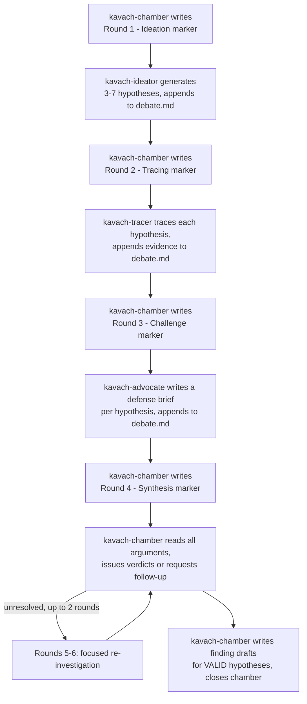

> Adapted from piolium (github.com/vigolium/piolium) - MIT License, © j3ssie.

# Review Chamber Protocol - Debate-Driven Deep Bug Hunting

Defines the debate format, agent interaction rules, round limits, and convergence criteria for
KAVACH's Review Chamber - a multi-agent debate team that hunts creative, chained, and business-logic
bugs that a single agent working alone structurally misses.

## Overview

A Review Chamber is a 4-role debate team that processes one threat cluster (a group of entry
points, sinks, or DFD-equivalent slices sharing a trust boundary). Four roles - **kavach-ideator**,
**kavach-tracer**, **kavach-advocate**, and **kavach-chamber** (the judge) - work through structured
rounds of hypothesis generation, evidence gathering, adversarial challenge, and verdict synthesis.

Findings emerge from structured argumentation, not solitary analysis. This is the whole point: a
single agent both imagining an attack and validating it shares one set of blind spots and one
confirmation bias. Splitting the roles across four passes - creative generation, technical tracing,
adversarial challenge, and judged synthesis - forces the claim to survive contact with a dedicated
skeptic before it becomes a finding.

**Which mode runs which shape:** a single-pass chamber (one cluster, `kavach-chamber` running
alongside `kavach-advocate` without a full 4-round debate) is the lighter form some modes use; the
full multi-round, multi-chamber debate below is the deep form. Both follow this protocol - the
lighter form just collapses Rounds 1-3 into one working pass instead of three separate agent turns.
Consult `docs/phase-reference.md` for which gate-artifact filename the invoking mode expects; this
protocol governs the lifecycle regardless of which mode invoked it, and none of the filenames below
are phase ids.

## Chamber formation

### Cluster formation

Once the knowledge base and static-analysis triage are in place:

1. Read `attack-surface/knowledge-base-report.md` for its DFD/CFD-equivalent high-risk slices and
   the `## Domain Attack Research` section; read `attack-surface/authz-matrix.md` and
   `attack-surface/unauthenticated-surface.md` if they exist.
2. Read `attack-surface/manual-attack-surface-inventory.md` or `attack-surface/deep-probe-summary.md`
   (whichever exists) for pre-validated hypotheses from `kavach-probe` - see the handoff note below.
3. Group slices by shared trust boundary or component affinity (slices touching the same data
   store, enforcement point, or transport layer belong together). Each cluster becomes one chamber.
4. A single-pass chamber gets one cluster (the highest-priority one). A full multi-chamber run
   typically produces 2-5 chambers depending on architecture complexity.
5. Priority ordering: authentication/authorization first, then money/key surfaces (billing,
   secrets), then the AI/LLM surface, then general business logic, then internal/admin components.

### Chamber workspace

```
.kavach/tmp/chamber-workspace/<cluster>/
  debate.md              # append-only debate transcript
  variant-candidates/    # kavach-variant-scout's live discoveries
```

`<cluster>` is a short descriptive slug (`auth-flows`, `data-ingestion`, `billing-webhooks`) chosen
when the cluster forms - not a phase id, not a global sequence number. This workspace is transient
(`tmp/`) and is wiped by the invoking mode's cleanup phase once the drafts it fed are promoted.

### Concurrency limit

Up to 3 chambers run simultaneously (matches `KAVACH_MAX_AGENTS`'s default scheduler cap). If more
than 3 clusters exist, run the first 3 in priority order and spawn the rest as earlier ones close.

## Agent roles and constraints

### kavach-ideator (Attack Ideator)

- Generates 3-7 attack hypotheses per batch by cycling through the 8 creative modes in
  `creative-attack-modes.md` (vulnerability chaining, business-logic abuse, race
  conditions/TOCTOU, second-order/stored attacks, trust-boundary confusion, parser/protocol
  differentials, state-machine attacks, supply-chain interaction).
- Does NOT trace code, does NOT issue verdicts.
- Reads: `attack-surface/knowledge-base-report.md` (threat model, domain attack research,
  attack surface), `findings.json` (the sast/api/etc. hits already on record for this cluster),
  `attack-surface/spec-gap-summary.md` if it exists.
- Writes: hypothesis batches to `debate.md`.
- If `debate.md` was pre-seeded with VALIDATED hypotheses from `kavach-probe` (see handoff below),
  builds on them - refines, chains, or cross-pollinates - rather than regenerating them from
  scratch.

### kavach-tracer (Code Tracer)

- Takes each hypothesis and traces it through the actual source with evidence.
- Traces primarily by `Read`/`Grep`/`Glob` across the real source tree plus the `findings.json`
  scanner slice for this cluster - KAVACH has no CodeQL structural-extraction step by default. If
  the optional `codeql` companion skill's database is available for this target, `kavach-tracer`
  may supplement with on-demand structural queries, but that is a delegate, never a requirement -
  the trace must stand on manual reading alone.
- Does NOT generate hypotheses, does NOT issue final verdicts.
- Produces a reachability verdict per hypothesis: **REACHABLE / UNREACHABLE / PARTIAL**, with a
  `file:line` chain from entry point to sink and every sanitizer/validator on the path noted as
  Blocks/Partial/Bypassable.
- Writes: per-hypothesis evidence blocks to `debate.md`.

### kavach-advocate (Devil's Advocate)

- Challenges EVERY hypothesis `kavach-tracer` marked REACHABLE.
- Searches five protection layers: **language, framework, middleware, application,
  documentation**. Must argue against even obvious-looking vulnerabilities - inability to
  construct a credible defense is itself strong evidence the finding is genuine.
- Explicitly checks the finding against the 8 Claude-specific false-positive patterns in
  `severity-model.md`'s triage-calibration section.
- Does NOT generate hypotheses, does NOT issue final verdicts.
- Reads: source code, framework docs, the target's `SECURITY.md` if present, deployment configs.
- Writes: a defense brief per hypothesis to `debate.md` (protection-layer table + FP-pattern check
  + strongest false-positive argument + a recommendation: cannot disprove, or disproved by
  `<layer>`).

### kavach-chamber (Chamber Synthesizer - judge)

- Orchestrates the debate by writing round markers to `debate.md` and dispatching each role's turn.
- Reads every argument from every role and makes the judgment call.
- Requests up to 2 additional focused-investigation rounds when evidence is insufficient.
- Assigns severity per `severity-model.md` (CVSS vector + band + severity chaining) - never a flat
  hand-picked label.
- The **only** role that writes finding drafts.
- Manages the attack-pattern registry (`attack-surface/attack-pattern-registry.json`).
- Does NOT generate hypotheses, does NOT trace code.

### kavach-variant-scout (optional, background)

- Monitors `debate.md` for confirmed patterns and concurrently searches for structural variants in
  sibling components while the chamber is still running, front-loading the later per-finding
  variant sweep (`kavach-variant`).
- Writes candidates to `.kavach/tmp/chamber-workspace/<cluster>/variant-candidates/` for
  `kavach-chamber` to decide whether they warrant a new debate round now or a deferred sweep later.

## Debate protocol

### Round flow



### Turn-taking rules

1. Only one role writes to `debate.md` at a time, serialized by round.
2. Each role appends to the end of the file - never edits a prior section.
3. Every section is tagged with the role name: `### [IDEATOR]`, `### [TRACER]`, `### [ADVOCATE]`,
   `### [CHAMBER]`.
4. Every section carries an ISO timestamp.

### Round limits

- **Maximum 7 hypotheses per ideation batch.** If more surface, `kavach-chamber` prioritizes by
  expected impact and defers the rest.
- **Maximum 3 rounds per hypothesis** (1 initial trace+challenge round + 2 follow-ups). Unresolved
  after 3, `kavach-chamber` issues a judgment call or marks it INCONCLUSIVE.
- **Maximum 6 total rounds per chamber** (ideation + tracing + challenge + synthesis + at most 2
  follow-ups). `kavach-chamber` may not request more than 2 follow-up rounds.
- **Maximum 3 concurrent chambers.**

## Convergence criteria

Debate ends for a hypothesis when any condition below is met. These are chamber-internal debate
verdicts - orthogonal to the `confidence: confirmed/suspected` field, which `kavach-chamber` still
sets per `severity-model.md`/`verification-gates.md` discipline once a hypothesis reaches VALID.

| Condition | Verdict | Action |
|---|---|---|
| UNREACHABLE, and the Advocate confirms no alternate path | DROP | No draft written |
| REACHABLE, and the Advocate cannot find a blocking protection after 2 attempts | VALID | Write finding draft |
| REACHABLE, and the Advocate finds a blocking protection | FALSE POSITIVE | No draft written |
| 3 rounds without resolution | Synthesizer judgment | Verdict or INCONCLUSIVE |
| Duplicate of an already-adjudicated finding (same root cause) | DUPLICATE | No draft written |
| Severity resolves to Low/INFO after calibration | DROP (low severity) | No draft written |

A chamber closes once every hypothesis has a terminal verdict.

## Pre-finding quality gate

Before `kavach-chamber` writes any finding draft, apply this 5-point check. This is
chamber-specific triage, run **before** the full six gates in `verification-gates.md` - a VALID
hypothesis must clear both this gate and those six before its confidence is finalized:

1. **Attacker control verified?** Did the Tracer confirm the input reaches the path, not merely
   infer it?
2. **Framework protection checked?** Did the Advocate search all 5 layers?
3. **Same-origin confusion?** Is this genuinely cross-trust-boundary, not same-session/same-origin?
4. **Config vs. vulnerability?** Does exploitation require only the normal attacker position, not
   admin?
5. **Test/example code?** Does the vulnerable code actually ship to production?

If any check fails, drop the finding. If ambiguous, `kavach-chamber` still writes the draft but
notes `pre_fp_flag: check-<N>-ambiguous` in the draft body for priority during
false-positive verification.

## Severity calibration

Calibrate exactly per `severity-model.md` - compute the CVSS vector, read the band off the score,
apply severity chaining when the hypothesis is a step in a longer chain. Do not hand-pick
MEDIUM/HIGH/CRITICAL by feel. **Only write drafts for findings that resolve to Medium or higher**
(CVSS ≥ 4.0) - Low/INFO verdicts DROP immediately and never reach `findings-draft/`.

## Attack pattern registry

File: `.kavach/attack-surface/attack-pattern-registry.json` (durable - survives cleanup).

When `kavach-chamber` confirms a finding, it checks the registry:
- Pattern already exists → append to `confirmed_instances`.
- New pattern → create an entry with `detection_signature` (grep and/or Semgrep patterns for the
  same bug class - no `codeql` field unless the optional `codeql` skill actually produced one for
  this target) and `untested_candidates` (a quick grep across the codebase for the same shape).

```json
{
  "patterns": [{
    "id": "AP-001",
    "title": "Unsafe ObjectInputStream deserialization",
    "bug_class": "deserialization",
    "root_cause": "ObjectInputStream.readObject() without an ObjectInputFilter",
    "detection_signature": {
      "grep": "<regex pattern>",
      "semgrep": "<semgrep pattern>"
    },
    "confirmed_instances": [
      {"finding_ref": "C1-admin-deser", "file": "src/admin/AdminService.java:142"}
    ],
    "untested_candidates": [
      {"file": "src/backup/BackupRestoreService.java:201", "reason": "uses ObjectInputStream"}
    ],
    "severity": "critical"
  }]
}
```

Other chambers read the registry before their own ideation rounds begin - `kavach-ideator`
incorporates confirmed patterns to look for the same bug class within its own cluster's scope. The
later per-finding variant sweep (`kavach-variant`) reads it as its primary input.

## Debate transcript format

File: `.kavach/tmp/chamber-workspace/<cluster>/debate.md`

```markdown
# Review Chamber: <cluster>

Cluster: <description of the threat cluster>
Slices: <comma-separated slice identifiers from the KB>
Started: <ISO timestamp>
Status: ACTIVE | CLOSED

---

## Round 1 - Ideation

### [IDEATOR] Hypothesis Batch - <ISO timestamp>

**H-01: <hypothesis title>**
- Attack class: <e.g. TOCTOU, second-order injection, trust-boundary confusion>
- Chain: <multi-step chain description if applicable, else "single-step">
- Preconditions: <attacker starting position>
- Target asset: <what the attacker gains>
- Entry point: <suspected entry, may be approximate>
- Sink: <suspected sensitive operation>
- Creativity signal: <why a solo agent would miss this>

---

## Round 2 - Tracing

### [TRACER] Evidence for H-01 - <ISO timestamp>

**Reachability: REACHABLE | UNREACHABLE | PARTIAL**

Code path:
1. `<file:line>` - <description>
2. `<file:line>` - <description>
3. `<file:line>` - <description>

Sanitizers on path:
- `<file:line>` - <description of control and bypassability>

**Assessment**: <summary of reachability evidence>

---

## Round 3 - Challenge

### [ADVOCATE] Defense Brief for H-01 - <ISO timestamp>

**Protection search results:**

| Layer | Protection Found | Blocks Attack? |
|-------|-----------------|----------------|
| Language | <finding> | <Yes/No> |
| Framework | <finding> | <Yes/No> |
| Middleware | <finding> | <Yes/No> |
| Application | <finding> | <Yes/No> |
| Documentation | <finding> | <Yes/No> |

**Claude FP pattern check**: <which of the 8 patterns from severity-model.md were checked, matches>

**Defense argument**: <strongest case for false positive>

**Verdict recommendation**: Cannot disprove | Disproved by <layer> protection

---

## Round 4 - Synthesis

### [CHAMBER] Verdict for H-01 - <ISO timestamp>

**Prosecution summary**: <key evidence from the Tracer>

**Defense summary**: <key argument from the Advocate>

**Pre-finding quality gate**: all checks passed | failed on check-<N>: <reason>

**Verdict: VALID | FALSE POSITIVE | DROP | DUPLICATE | INCONCLUSIVE**
**Severity**: <CVSS vector + score + band, per severity-model.md> (only for VALID)
**Rationale**: <one-sentence justification citing evidence from both sides>

**Finding draft written**: <yes/no> **Registry updated**: AP-<NNN> <title> (or "no new pattern")

---

## [Optional] Round 5 - Focused Re-investigation

### [CHAMBER] Investigation Request - <ISO timestamp>

**Directed to**: TRACER | ADVOCATE
**Regarding**: H-<NN>
**Question**: <specific question that would resolve the ambiguity>

### [TRACER|ADVOCATE] Response for H-<NN> - <ISO timestamp>
...

---

## Chamber Summary

| Hypothesis | Verdict | Severity | Finding Draft |
|-----------|---------|----------|---------------|
| H-01 | VALID | HIGH | <draft id> |
| H-02 | FALSE POSITIVE | - | - |
| H-03 | DROP (unreachable) | - | - |

Findings written: <count>
Patterns added to registry: <count>
Variant candidates: <count>

Chamber closed: <ISO timestamp>
```

## Writing finding drafts

For each VALID verdict, `kavach-chamber` writes a draft into `findings-draft/`. Use the exact
frontmatter `finding-schema.md`'s "Draft frontmatter" section defines - do not add ad-hoc keys to
the frontmatter itself; extra chamber-specific context goes in the body:

```yaml
---
id: <prefix>-<NNN>        # engine-assigned - do not invent this yourself; write via kavach ingest
                            # or the filename the orchestrator handed you for this phase
phase: <domain-or-phase>   # whatever the invoking phase/domain is
slug: <slugified title>
severity: critical|high|medium|low|info
confidence: confirmed|suspected
kavach_id: KAVACH-<sha1[:10]>
---

# <Title>

## Summary
## Location
## Attacker Control
## Trust Boundary Crossed
## Impact
## Evidence
## Reproduction Steps

## Chamber Provenance
- Cluster: <cluster>
- Debate: .kavach/tmp/chamber-workspace/<cluster>/debate.md
- Verdict: VALID
- Pre-FP flag: <none | check-N-ambiguous>
```

Populate every body section. `Evidence` carries the Tracer's code path; `Reproduction Steps`
carries the pseudocode/negative-PoC context from `verification-gates.md`'s evidence templates -
this is the draft `kavach-poc` later formalizes into the finding-dir's `poc.py`/`poc.theoretical.md`.

## Chamber closure

1. Write the Chamber Summary table (above) to `debate.md`.
2. Update `Status` to `CLOSED` in the header.
3. Report to the caller: chamber, cluster, hypothesis count, findings written, patterns added,
   variant candidates queued.

## Post-chamber verification

The Advocate already performed most of the adversarial-review work during the debate - so the
false-positive verification step downstream is lighter than it would be for a solitary finding:

- **Every VALID finding** still gets `verification-gates.md`'s checklist applied at least once -
  this catches systematic false-positive patterns the Advocate might share with the other roles in
  the same chamber (they're reading the same code with the same blind spots).
- **Critical/High VALID findings** are escalated to `kavach-verifier` for a fresh, zero-context
  cold re-verification - no debate transcript, no chamber reasoning, only the finding draft path.
  Findings carrying `pre_fp_flag` get priority.
- **Medium findings skip cold re-verification** - the chamber's Advocate already challenged them
  during the debate; re-litigating from zero context is not worth the cost at that severity.

## Error recovery

- **A role crashes mid-round**: `kavach-chamber` detects a missing response and reports it; a
  replacement agent is spawned with the current `debate.md` transcript as context.
- **A chamber stalls**: if `debate.md` gets no new content for an extended period, `kavach-chamber`
  is prompted to check status or force convergence with the evidence already on hand.
- **Session recovery**: read `debate.md`'s `Status` field. An `ACTIVE` chamber with incomplete
  rounds resumes from the last completed round marker rather than restarting.

## Handoff from the deep-probe team

If `kavach-probe` ran first (see `probe-protocol.md`), `kavach-chamber` reads its
`probe-summary.md` at Initialize and pre-seeds every VALIDATED hypothesis into `debate.md` as an
`H-00` entry (or a numbered block ahead of `H-01`), tagged with its origin reasoning model. The
Ideator is instructed to build on these rather than regenerate them; the Tracer is instructed to
verify and extend the probe team's existing evidence rather than re-trace from scratch.

## Hard limits (summary)

- Maximum 7 hypotheses per ideation batch.
- Maximum 3 rounds per hypothesis (1 + 2 follow-ups).
- Maximum 6 total rounds per chamber.
- Maximum 3 concurrent chambers.
- Only write drafts for Medium-or-higher CVSS band.
